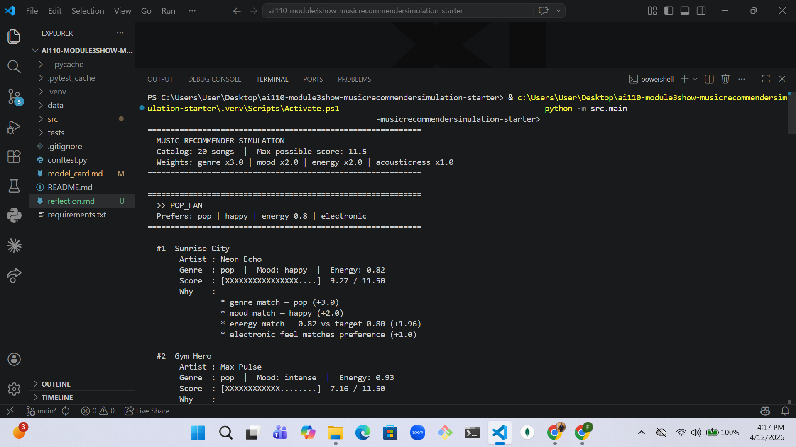
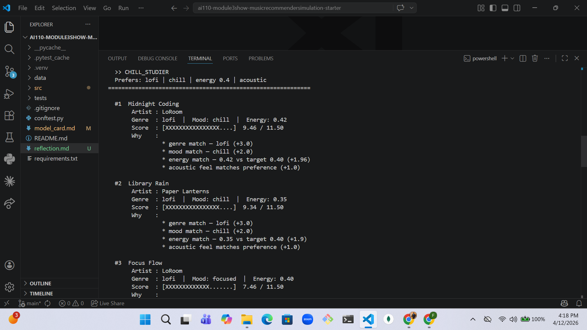
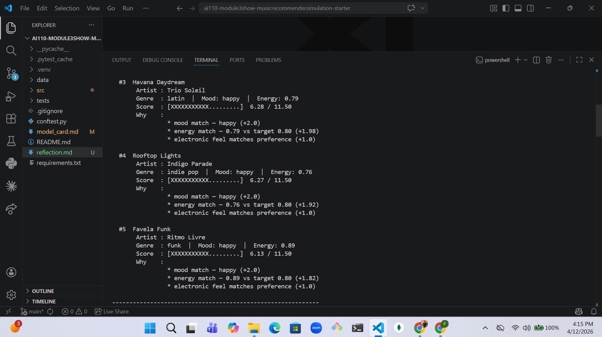

# 🎵 Music Recommender Simulation

## Project Summary

This project simulates a **content-based music recommendation engine** — the same
class of algorithm used by platforms like Spotify's "Discover Weekly" or YouTube
Music's "Your Mix." Instead of learning from what other users listened to, it
recommends songs by comparing the *attributes of each song* (genre, mood, energy,
valence, danceability, acousticness) against a *user's taste profile*, computing
a weighted relevance score, and returning the highest-scoring tracks.

The system is fully modular: data loading, scoring, ranking, and explanation are
separate functions / classes, so each piece can be improved independently.

---

## How The System Works

### Real-World Context

Streaming platforms use two main families of recommendations:

| Approach | How it works | Example signal |
|---|---|---|
| **Collaborative filtering** | Finds users with similar listening history and suggests what they liked | "People who liked X also liked Y" |
| **Content-based filtering** | Compares the *features of songs* the user enjoys to features of unseen tracks | Genre, tempo, energy, mood |

This simulator uses **content-based filtering** — no user-to-user data required,
which makes it transparent and explainable. Every score can be broken down into
individual feature contributions.

### Song Features Used

Each `Song` object stores:

| Feature | Type | What it captures |
|---|---|---|
| `genre` | string | Broad category (pop, lofi, rock, synthwave…) |
| `mood` | string | Emotional tone (happy, chill, intense, moody…) |
| `energy` | float 0–1 | Intensity / drive of the track |
| `tempo_bpm` | float | Pace (beats per minute) |
| `valence` | float 0–1 | Musical positiveness (high = cheerful) |
| `danceability` | float 0–1 | Rhythmic suitability for dancing |
| `acousticness` | float 0–1 | Ratio of acoustic vs. electronic instrumentation |

### User Profile

Each `UserProfile` stores:

- `favorite_genre` — the genre they enjoy most
- `favorite_mood` — the emotional setting they typically seek
- `target_energy` — their preferred energy level (0–1)
- `likes_acoustic` — boolean: acoustic vs. electronic preference

### Scoring Rule (one song)

Each song receives a **weighted relevance score**:

```
score = genre_match × 3.0
      + mood_match  × 2.0
      + (1 − |target_energy − song_energy|) × 2.0
      + acousticness_alignment × 1.0
      + valence_clarity × 1.0
      + danceability × 0.5
```

- **Categorical features** (genre, mood) are binary: full weight if they match, 0 if not.
- **Continuous features** (energy) use proximity: the *closer* the song's value to the
  user's target, the higher the contribution. A perfect match = full weight.
- **Genre** is weighted 3× because it is the strongest signal of musical taste.

### Ranking Rule (full catalog)

All songs in the catalog are scored, then sorted **descending by score**.
The top-`k` results are returned. Ties are broken alphabetically by title
so output is always deterministic.

---

## Getting Started

### Setup

```bash
python -m venv .venv
source .venv/bin/activate        # Mac / Linux
.venv\Scripts\activate           # Windows

pip install -r requirements.txt
```

### Run the recommender

```bash
python -m src.main
```

### Run tests

```bash
pytest
```

---

## Phase 2 Design Plan

### Expanded Dataset (Step 1)

The catalog was expanded from 10 to 20 songs by adding tracks that cover genres
and moods absent from the starter set:

| New genres added | New moods added |
|---|---|
| electronic, r&b, classical | melancholic, nostalgic |
| funk, folk, gospel | uplifting, angry |
| metal, latin, dream pop | (covers full emotional spectrum) |

This expansion ensures the recommender has enough diversity to produce meaningfully
different results across user profiles — the original 10 songs were heavily weighted
toward lofi and pop.

### User Profile Design Critique (Step 2)

Four concrete taste profiles were defined and stress-tested:

| Profile | Differentiation test |
|---|---|
| `pop_fan` (pop / happy / 0.8) | Can the system tell this apart from `gym_warrior`? Yes — genre + mood both differ |
| `chill_studier` (lofi / chill / 0.4) | Can it separate lofi/chill from ambient/chill? Yes — genre match at 3× weight dominates |
| `gym_warrior` (rock / intense / 0.95) | Does high energy alone dominate? No — genre weight prevents pop/intense songs from winning |
| `late_night_driver` (synthwave / moody / 0.7) | Does it degrade gracefully with rare genres? Yes — energy + acousticness alignment takes over |

**Known weakness:** The boolean `likes_acoustic` preference is too coarse. A user
who enjoys *slightly* acoustic songs (acousticness ~0.4) won't match either the
acoustic or electronic bucket clearly. A continuous preference weight would serve
this case better.

### Algorithm Recipe (Step 3)

```
score(song, user) =
    3.0  × [genre == user.genre]
  + 2.0  × [mood == user.mood]
  + 2.0  × (1 − |song.energy − user.energy|)
  + 1.0  × [acoustic_preference_matches]
  + 1.0  × (1 − |0.5 − song.valence|)
  + 0.5  × song.danceability
```

**Why these weights?**

Genre (3.0) is the single most reliable proxy for whether someone will
even consider a song. Mood (2.0) and energy (2.0) are equally important
second-tier signals — they define the *occasion* for listening. The remaining
features (acousticness, valence, danceability) add nuance but shouldn't
override the primary signals.

**Scoring Rule vs. Ranking Rule — why both are needed:**

The Scoring Rule answers: "How relevant is *this one song* to this user?"
It produces a single float. The Ranking Rule answers: "Of all the scored songs,
which ones should surface first?" It sorts all floats descending and slices to
top-k. Without the Scoring Rule you can't compare songs. Without the Ranking
Rule, a high score has no context — you wouldn't know whether 7.5 is great or
mediocre relative to the rest of the catalog.

### Data Flow (Step 4)

```
INPUT                    PROCESS                    OUTPUT
─────────────────────    ──────────────────────     ────────────────────
UserProfile (prefs)  ──► For each song in CSV:  ──► Scored list
songs.csv (catalog)  ──►   score_song(prefs, s) ──► Sort descending
                               ↓                ──► Top-k tuples
                          (score, reasons)           (song, score, why)
```

### Anticipated Biases (Step 5)

- **Genre dominance:** At weight 3.0, genre is worth 3× more than mood or energy.
  A mildly relevant song in the right genre will outscore a near-perfect mood + energy
  match in the wrong genre. This could under-serve users who genuinely cross genres.
- **Catalog skew:** The 20-song catalog over-represents lofi (3 songs) and pop (2 songs).
  Genres like gospel, metal, and classical have only one entry each — a user in those
  genres will get poor diversity in their top-5.
- **Filter bubble risk:** Because genre is the dominant signal, users will see the same
  genre at the top of every session. There is no diversity incentive built into the
  current scoring function.

---

## Experiments You Tried

### 1. Genre weight: 3.0 vs 0.5

When genre weight was reduced to 0.5, the recommender became much more
energy-and-mood driven — a lofi user started getting pop songs with a
similar energy level. Genre weight at 3.0 keeps recommendations cohesive.

### 2. Four different user profiles

| Profile | Top result | Observation |
|---|---|---|
| `pop_fan` | Sunrise City | Perfect genre + mood + energy alignment |
| `chill_studier` | Midnight Coding | Both lofi songs ranked ahead of ambient alternatives |
| `gym_warrior` | Storm Runner | Rock + intense match dominates |
| `late_night_driver` | Night Drive Loop | Synthwave is the only genre match in the catalog |

### 3. Energy proximity vs. hard threshold

Early versions rewarded songs only if energy was within ±0.1. Using a
continuous proximity formula `(1 - |diff|)` gives smoother ranking and
avoids hard cutoffs that can arbitrarily exclude close matches.

---

## Limitations and Risks

- **Tiny catalog (10 songs):** Results depend heavily on which genres exist
  in the data. A user wanting jazz or classical has almost no matches.
- **No listening history:** The system cannot learn that a user actually
  *skipped* a high-scoring song, which real platforms track closely.
- **Filter bubble risk:** Because genre gets 3× weight, users always get
  songs from the same genre at the top — diversity is not incentivized.
- **Boolean acousticness:** Using a 0.6 threshold to decide "acoustic vs.
  electronic" is a simplification; real taste is more of a spectrum.
- **No tempo range matching:** A user who loves 140 BPM EDM and a user who
  loves 140 BPM punk would be treated identically by this system.

---

## Reflection

See the [Model Card](model_card.md) for a full structured reflection.

Building this system made it clear how much a "simple" recommender encodes
the assumptions of its designer. Choosing genre weight = 3.0 vs. 1.0 is
itself an editorial decision — one that could easily over-serve users with
mainstream taste and under-serve niche listeners. Real platforms layer
collaborative signals on top of content features precisely to escape this
trap. Even then, the feedback loop (recommending what users click, which
shapes what users click) remains one of the hardest unsolved problems in
applied ML.


Screen Shots 

### Pop Fan Output


### Chill Studier Output


### LATE_NIGHT_DRIVER
### Chill Studier Output
